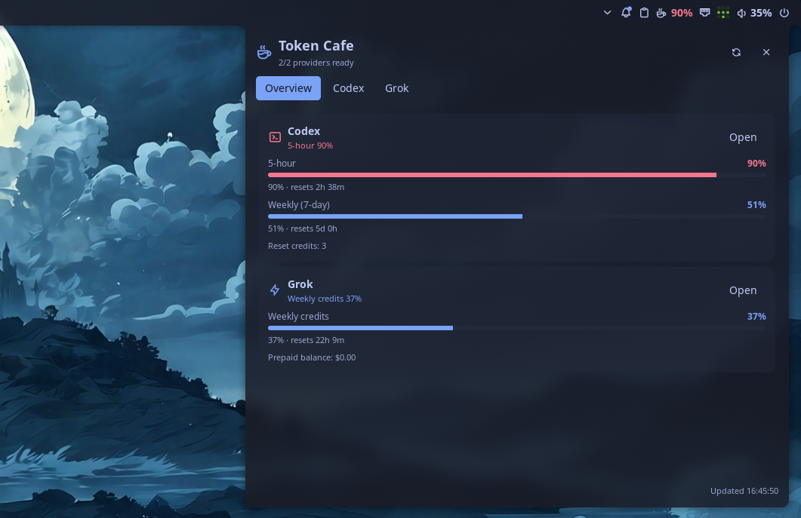

# Token Cafe ☕

Small Noctalia 5 plugin that keeps an eye on your AI subscription usage.



That's basically it: a couple of little meters on your bar, and a panel with the details when you want them.

## What it tracks

- Codex (5h + weekly)
- Claude Code
- Google Antigravity
- OpenCode
- OpenRouter
- Grok Build
- Venice.ai

Each provider just shows up as a card with its quotas, resets, and balances. Enable/disable whatever you use in Settings → Plugins.

## Try it locally

```bash
cargo build --release --manifest-path helper/Cargo.toml
mkdir -p ~/.local/share/noctalia/plugins
cp -r . ~/.local/share/noctalia/plugins/token-cafe
# enable in Noctalia, then add the "Token Cafe: bar" widget to a bar
```

Needs whatever CLIs/keys you actually use (`codex`, `opencode`, `grok`, `OPENROUTER_API_KEY`, etc.) — no Python, just a tiny Rust helper (`tc-probe`) for the stuff Luau can't do directly.

## Checks

```bash
noctalia plugins lint .
cargo test --manifest-path helper/Cargo.toml
```
